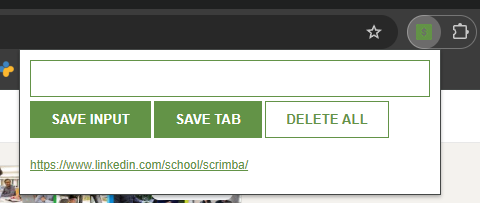

# Leads Tracker Chrome Extension

A simple Chrome extension that allows you to save important URLs/leads for later reference. Perfect for sales professionals, researchers, or anyone who needs to keep track of websites they visit.

## Features

- Save URL inputs manually
- Save the current tab's URL with one click
- Open saved leads in new tabs
- Store leads locally for persistence between browser sessions
- Simple and clean user interface
- Delete all saved leads with a double-click

## Installation

### From Chrome Web Store
*(Note: Add this section when published to the Chrome Web Store)*

### Manual Installation
1. Download or clone this repository
2. Open Chrome and navigate to `chrome://extensions/`
3. Enable "Developer mode" in the top-right corner
4. Click "Load unpacked" and select the extension directory
5. The extension should now appear in your Chrome toolbar

## Usage

1. Click on the Leads Tracker extension icon in your Chrome toolbar
2. To save the current tab URL: Click the "SAVE TAB" button
3. To manually save a URL: Enter it in the input field and click "SAVE INPUT"
4. To view a saved lead: Click on any of the saved URLs in the list
5. To delete all saved leads: Double-click the "DELETE ALL" button

## File Structure

- `manifest.json` - Extension configuration file
- `index.html` - Popup HTML structure
- `index.css` - Styles for the popup
- `index.js` - JavaScript functionality
- `icon.png` - Extension icon

## Development

To modify this extension:

1. Make changes to the source files
2. Reload the extension in `chrome://extensions/` by clicking the refresh icon
3. Test your changes by opening the extension

## Permissions

This extension requires the following permissions:
- `tabs` - To access the URL of the currently active tab

## License

This project is licensed under the MIT License - see the [LICENSE](LICENSE) file for details.

## Author

David McCullough

## Contributing

Contributions are welcome! Please feel free to submit a Pull Request.

